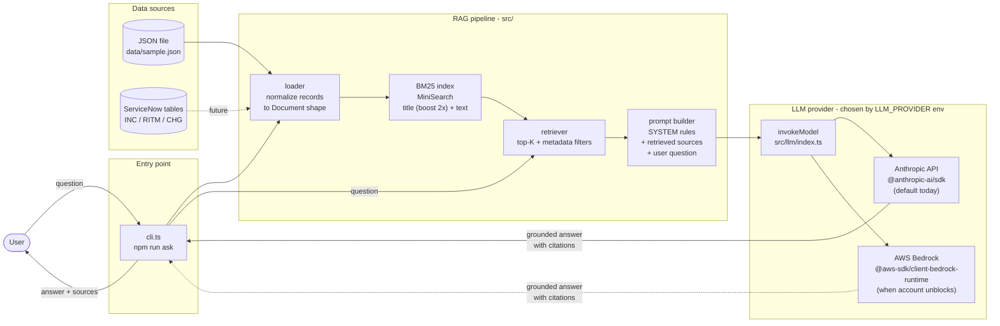
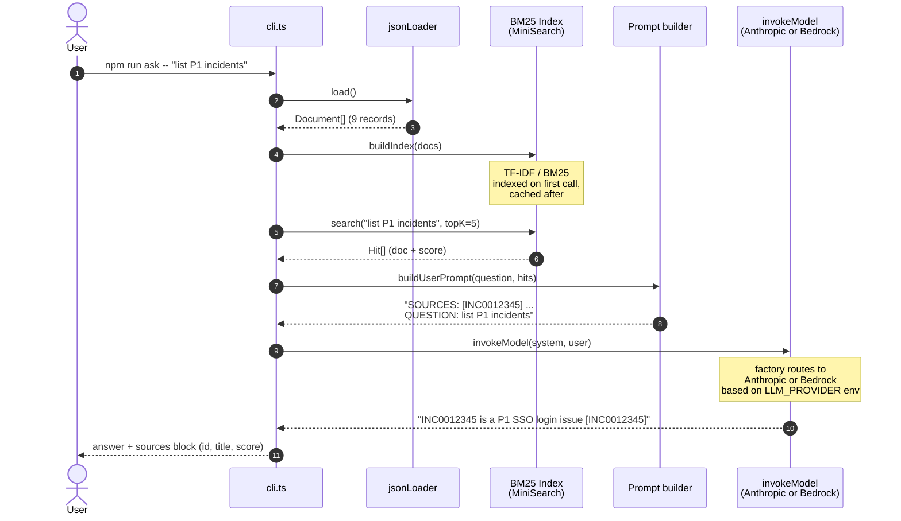
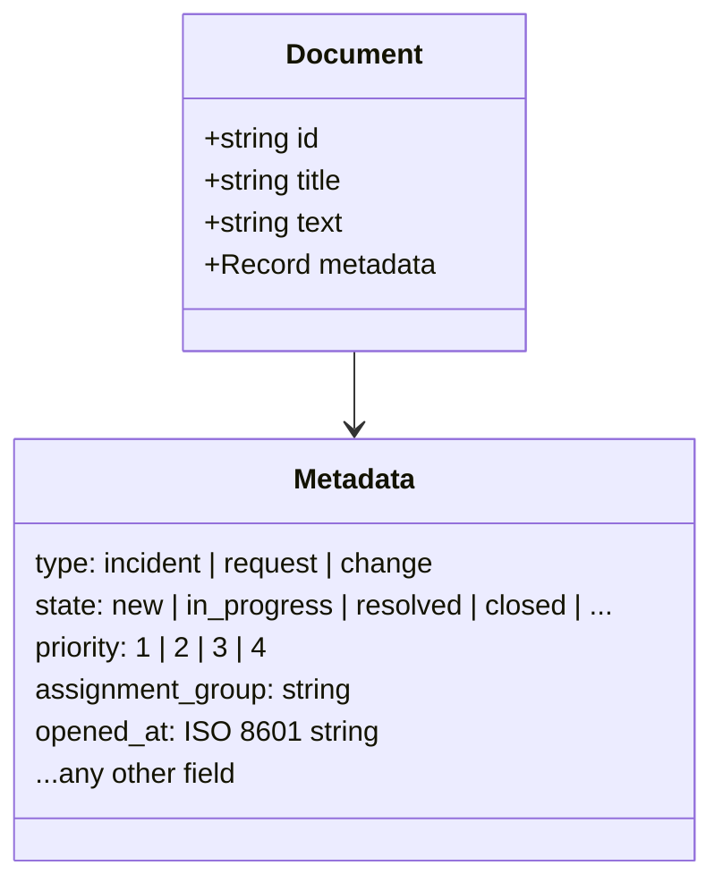
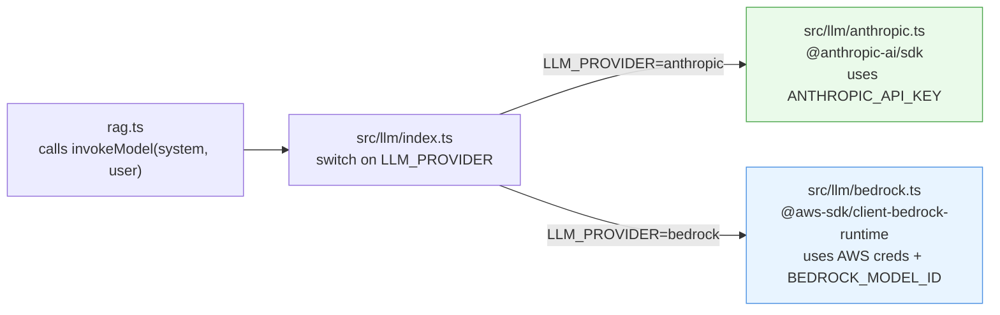
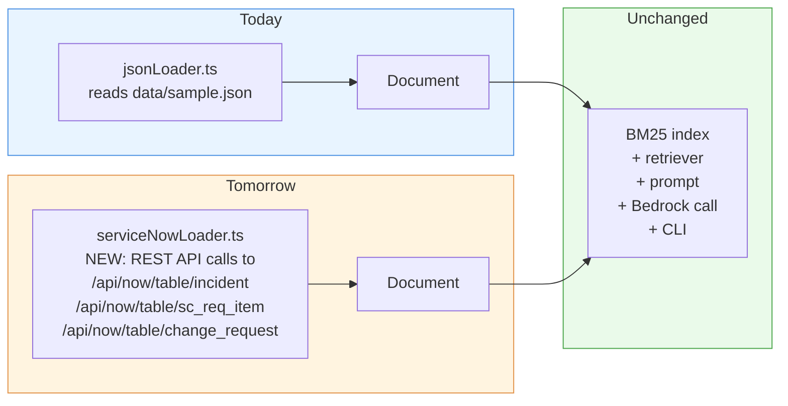

# Architecture

A short demo deck for the team. All diagrams below are written in Mermaid and render directly when this file is viewed on GitHub.

---

## What this system is

A **vectorless RAG** (Retrieval-Augmented Generation) system. It answers natural-language questions over a corpus of structured records (today: a JSON file of ServiceNow-shaped tickets; tomorrow: live ServiceNow data).

Three things make it different from a typical RAG:
- **No embeddings, no vector database.** Retrieval uses BM25 keyword search (`MiniSearch` library) plus metadata filters. This is a better fit for ticket data because it has rich structured metadata (state, priority, assignment_group, dates) and users often search by exact terms (ticket numbers, error strings, team names).
- **No LangChain.** Direct SDK calls. One prompt, one model call.
- **Pluggable LLM provider behind one function.** `invokeModel(system, user)` is implemented by both the Anthropic API (`src/llm/anthropic.ts`) and AWS Bedrock (`src/llm/bedrock.ts`); an env flag (`LLM_PROVIDER`) picks the active one. The rest of the pipeline doesn't know or care which one is wired in.

The result: small dependency surface, zero infrastructure to operate, and a clean migration path from local JSON to ServiceNow and from one LLM backend to another.

---

## High-level architecture

**Key design decisions:**
- `Document { id, title, text, metadata }` is the single contract every loader must produce. Nothing downstream knows or cares whether a record came from JSON or ServiceNow.
- The BM25 index is built in-process and cached after the first call. For larger corpora it can be persisted to disk via `MiniSearch.toJSON()` / `loadJSON()`.
- The LLM call goes through `invokeModel(system, user)` in `src/llm/index.ts`. The active backend is picked from the `LLM_PROVIDER` env var at startup (`anthropic` or `bedrock`). Adding a new provider is one new file + one case in the factory.

---

## What happens for a single question

**Notable beats during the demo:**
- Step 5: BM25 scoring is deterministic and explainable — you can show retrieval scores in the output and explain *why* each document was picked.
- Step 8: the system prompt forces grounding. If the retrieved sources don't contain the answer, Claude is instructed to say "I don't have enough information." rather than hallucinate.
- Step 8: citations like `[INC0012345]` are required for any claim, making answers auditable.
- Step 9: the provider factory is the swap point — same call shape regardless of backend.

---

## Data shape (the only contract that matters)

Every loader produces an array of these:

`text` is what gets BM25-indexed (concatenated `short_description + description + work_notes`). `metadata` is opaque to the index but available for pre-filtering (e.g. only `state in ("new","in_progress")`).

---

## LLM provider abstraction (swap backends with one env var)

Both providers expose the same `invoke(system: string, user: string) => Promise<string>` signature. The factory in `src/llm/index.ts` picks one at startup based on the `LLM_PROVIDER` env var. The rest of the pipeline is provider-agnostic.

**Why this matters for our team:** our AWS account (AISPL/India) currently has Bedrock Marketplace subscriptions for Anthropic models on hold — a soft hold on new AISPL accounts that clears as the account builds spending history. Until then we run on the direct Anthropic API; when AWS opens Bedrock for us we flip `LLM_PROVIDER=bedrock` in `.env` and nothing else changes.

---

## How JSON -> ServiceNow happens (one file)

Migration cost: one new file (`src/loaders/serviceNowLoader.ts`), one case in the loader factory, one env flag flip. The retriever, prompt, LLM call, and CLI are untouched.

---

## What's in scope today vs. later

| Concern | Today (v1) | Later |
|---|---|---|
| Data source | Local JSON file | ServiceNow REST API |
| Retrieval | BM25 + simple metadata filters | Add query rewriting if needed; semantic re-ranking optional |
| Index | Rebuilt per process, in-memory | Persisted index, refreshed on schedule |
| Interface | CLI | HTTP endpoint, Slack bot, web UI |
| LLM | Anthropic API (Claude Sonnet 4.5) via `LLM_PROVIDER=anthropic` | AWS Bedrock Claude via `LLM_PROVIDER=bedrock` once AWS account unblocks |
| Observability | console.log of scores | Structured logs, latency metrics, eval harness |
| Auth | API key in env (dev) | IAM role with scoped `bedrock:InvokeModel` on specific model ARN |

---

## Demo script (suggested 5-minute flow)

1. **One-sentence pitch** — "Question-answering over our ServiceNow data, no vector DB, no embedding cost, runs entirely on AWS."
2. **Show the data** — open `data/sample.json`, point out the ServiceNow-shaped fields.
3. **Run a query** — `npm run ask -- "what database change is scheduled?"` → show the grounded answer + `[CHG0030021]` citation + the score block.
4. **Show grounding** — `npm run ask -- "what is the meaning of life?"` → "I don't have enough information." → explain how the system prompt enforces this.
5. **Show the architecture diagram** (this file) — walk through the four boxes; emphasize the loader is the only thing that changes for ServiceNow.
6. **Show the migration cost** — open `src/loaders/index.ts`, point at the `case 'servicenow':` line. That's the whole plug point.

---

## Files referenced in these diagrams

| Component in diagram | File |
|---|---|
| CLI | [src/cli.ts](../src/cli.ts) |
| Loader (JSON) | [src/loaders/jsonLoader.ts](../src/loaders/jsonLoader.ts) |
| Loader factory | [src/loaders/index.ts](../src/loaders/index.ts) |
| BM25 index | [src/retriever/bm25.ts](../src/retriever/bm25.ts) |
| Metadata filters | [src/retriever/filter.ts](../src/retriever/filter.ts) |
| Prompt builder | [src/llm/prompt.ts](../src/llm/prompt.ts) |
| LLM factory | [src/llm/index.ts](../src/llm/index.ts) |
| Anthropic provider | [src/llm/anthropic.ts](../src/llm/anthropic.ts) |
| Bedrock provider | [src/llm/bedrock.ts](../src/llm/bedrock.ts) |
| Pipeline glue | [src/rag.ts](../src/rag.ts) |
| Document contract | [src/types.ts](../src/types.ts) |
